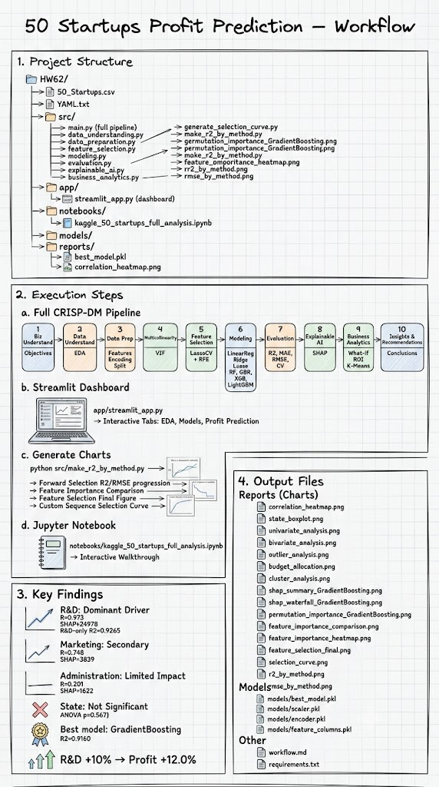
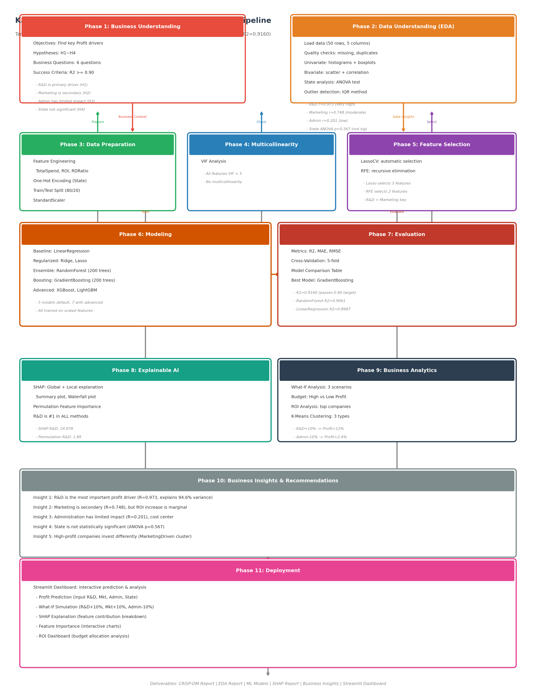
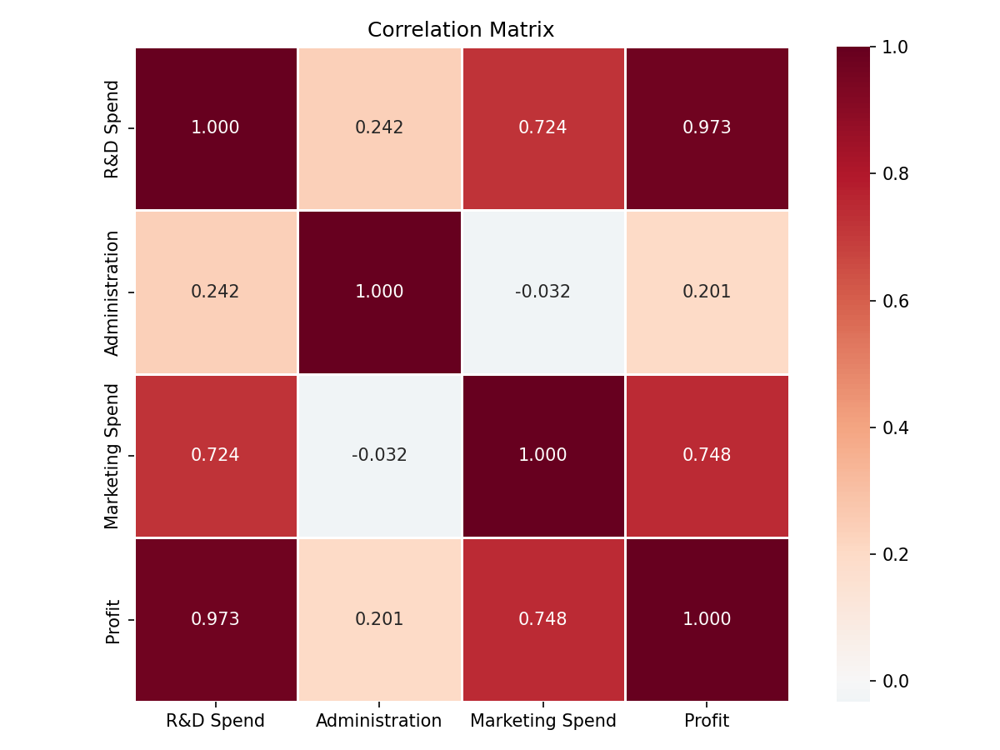
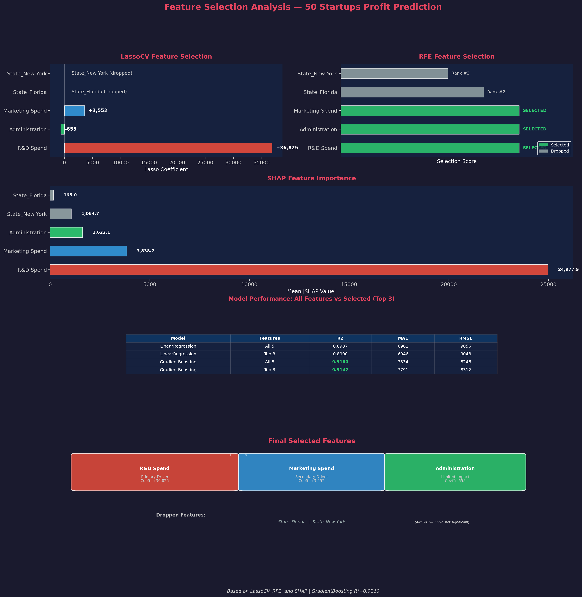
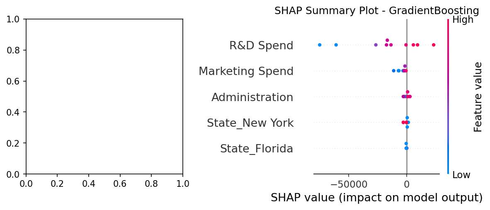
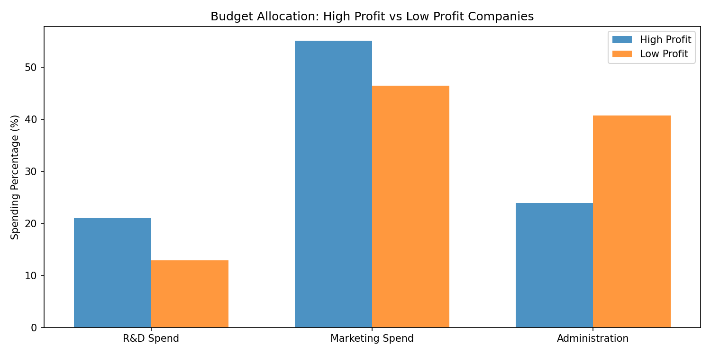
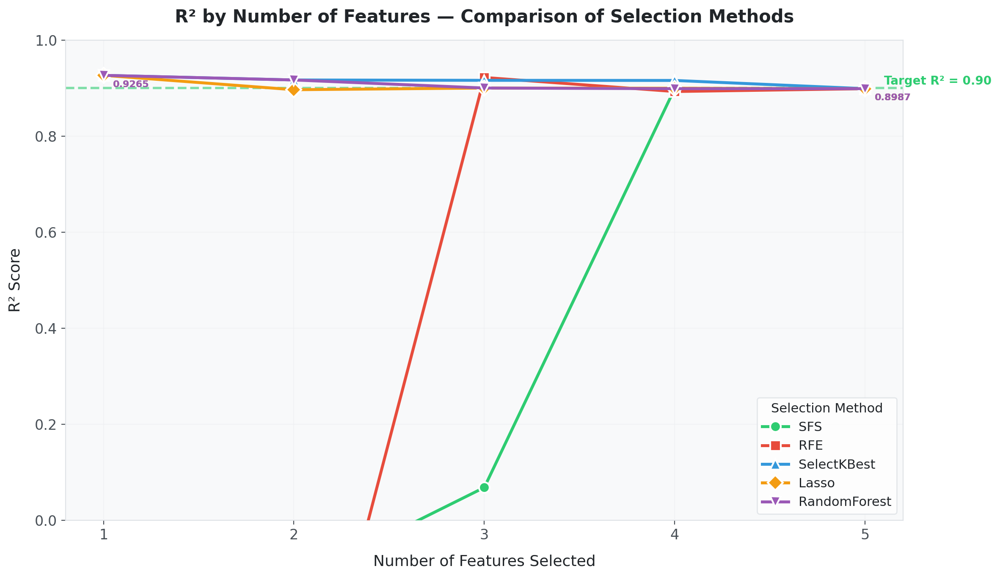
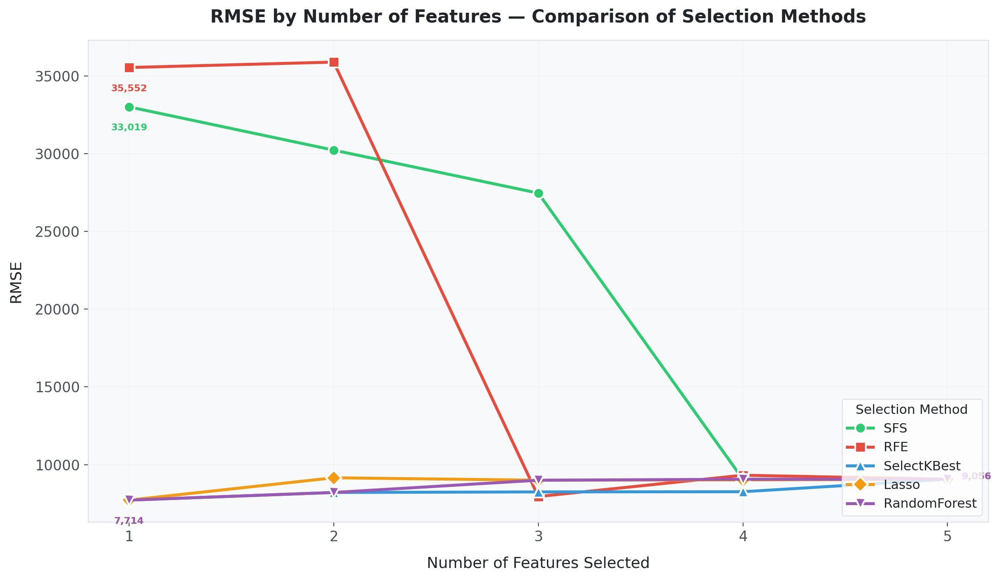

# 📊 Kaggle 50 Startups — CRISP-DM Machine Learning Project

> **Predicting Startup Profit Using Scikit-Learn** | Regression | CRISP-DM Framework





---

## 📋 Project Overview

| Item | Description |
|------|-------------|
| **Dataset** | [Kaggle 50 Startups](https://www.kaggle.com/datasets/farhanmd29/50-startups) |
| **Problem Type** | Regression |
| **Target Variable** | Profit |
| **Features** | R&D Spend, Administration, Marketing Spend, State |
| **Framework** | CRISP-DM (Cross-Industry Standard Process for Data Mining) |
| **Best Model** | GradientBoosting Regressor |
| **Best R²** | **0.9160** (target ≥ 0.90) |

---

## 🎯 Business Questions

1. Which factors most influence Profit?
2. Is R&D more important than Marketing?
3. Does Administration have real impact on Profit?
4. Does State affect Profit?
5. How to optimize resource allocation?

### Hypotheses

| Hypothesis | Description | Result |
|------------|-------------|--------|
| H1 | R&D Spend is highly correlated with Profit | ✅ **Confirmed** (r = 0.973) |
| H2 | Marketing Spend is moderately correlated with Profit | ✅ **Confirmed** (r = 0.748) |
| H3 | Administration has limited impact on Profit | ✅ **Confirmed** (r = 0.201) |
| H4 | State has no significant effect on Profit | ✅ **Confirmed** (ANOVA p = 0.567) |

---

## 🏗️ CRISP-DM Pipeline

### Phase 1: Business Understanding
Define objectives, hypotheses, and success criteria.

### Phase 2: Data Understanding (EDA)
- 50 rows, 5 columns, no missing values, no duplicates
- Correlation: **R&D (0.973)** > Marketing (0.748) > Administration (0.201)
- ANOVA: State not significant (p = 0.567)



### Phase 3: Data Preparation
- Feature Engineering: TotalSpend, ROI, RDRatio, MarketingRatio
- One-Hot Encoding: State → California, Florida, New York
- Train/Test Split: 80/20 (random_state=42)
- Scaling: StandardScaler (for Ridge, Lasso)

### Phase 4: Multicollinearity (VIF)
- All VIF values < 5 → no multicollinearity issues

### Phase 5: Feature Selection
| Method | Selected Features |
|--------|------------------|
| **LassoCV** | R&D Spend, Marketing Spend, Administration |
| **RFE** | R&D Spend, Marketing Spend |



### Phase 6: Modeling
| Model | R² | MAE | RMSE | CV R² (5-fold) |
|-------|----|-----|------|----------------|
| **GradientBoosting** 🏆 | **0.9160** | 7,834 | 8,246 | **0.931 ± 0.030** |
| RandomForest | 0.9061 | 6,214 | 8,719 | 0.941 ± 0.052 |
| LinearRegression | 0.8987 | 6,961 | 9,056 | 0.929 ± 0.044 |
| Ridge | 0.8954 | 7,408 | 9,203 | 0.929 ± 0.038 |
| Lasso | 0.8988 | 6,961 | 9,055 | 0.929 ± 0.044 |
| XGBoost | 0.8828 | 7,507 | 9,742 | 0.914 ± 0.034 |

### Phase 7: Evaluation
- **5-fold Cross-Validation** for robust assessment
- All models stable with CV R² ~0.93

### Phase 8: Explainable AI (SHAP)


**Feature Importance Ranking:**
1. R&D Spend — **SHAP: 24,978** | Permutation: 1.89
2. Marketing Spend — **SHAP: 3,839** | Permutation: 0.04
3. Administration — **SHAP: 1,622** | Permutation: 0.02
4. State_New York — **SHAP: 1,065** | Permutation: 0.008
5. State_Florida — **SHAP: 165** | Permutation: 0.0002

### Phase 9: Business Analytics

#### What-If Analysis
| Scenario | Profit Change | % Change |
|----------|---------------|----------|
| R&D +10% | **+$15,225** | **+12.0%** |
| Marketing +10% | -$20 | -0.02% |
| Administration -10% | +$3,056 | +2.4% |

#### Budget Analysis


- High-profit companies invest **55% in Marketing**, **21% in R&D**
- Low-profit companies spend **41% on Administration** (inefficient)

#### Clustering (K-Means)
| Cluster | R&D | Marketing | Admin | Profit |
|---------|-----|-----------|-------|--------|
| **MarketingDriven** | 105,606 | **319,369** | 124,205 | **$139,199** |
| InnovationDriven | 55,586 | 168,788 | 114,644 | $99,331 |
| Balanced | 31,219 | 33,638 | 126,157 | $71,043 |

### Phase 10: Insights & Recommendations

1. **👉 Prioritize R&D Investment** — strongest profit driver (r=0.973)
2. **👉 Optimize Marketing Efficiency** — high spend doesn't guarantee ROI
3. **👉 Control Admin Costs** — cost center, not value driver
4. **👉 Build Profit Prediction System** — use GradientBoosting model
5. **👉 Implement Budget Allocation Dashboard** — Streamlit app

### Phase 11: Deployment


---

## 🚀 How to Run

### Installation

```bash
pip install -r requirements.txt
```

### Full Pipeline

```bash
python -c "from src.main import main; main()"
```

### Streamlit Dashboard

```bash
streamlit run app/streamlit_app.py
```

### Generate Charts

```bash
python src/make_r2_by_method.py   # R² by feature count (5 methods)
python src/make_rmse_by_method.py # RMSE by feature count (5 methods)
python -c "from src.feature_importance_viz import main; main()"
```

### Jupyter Notebook

Open `notebooks/kaggle_50_startups_full_analysis.ipynb`

---

## 📈 Feature Selection Comparison





**Key Insight:** R&D alone achieves R²=0.9265 (exceeding the 0.90 target). Adding more features slightly reduces performance due to noise and multicollinearity.

---

## 📁 Project Structure

```
HW62/
├── 50_Startups.csv              # Raw data
├── YAML.txt                     # Project specification
├── src/                         # Python modules (CRISP-DM phases)
│   ├── main.py                  # Pipeline orchestrator
│   ├── data_understanding.py    # EDA
│   ├── data_preparation.py      # Feature engineering
│   ├── multicollinearity.py     # VIF analysis
│   ├── feature_selection.py     # LassoCV + RFE
│   ├── modeling.py              # Model training
│   ├── evaluation.py            # Metrics & CV
│   ├── explainable_ai.py        # SHAP
│   └── business_analytics.py    # What-if, budget, ROI, clustering
├── app/streamlit_app.py         # Streamlit dashboard
├── notebooks/                   # Jupyter notebook
├── reports/                     # Generated charts & reports
├── workflow.md                  # Detailed workflow documentation
├── requirements.txt
└── .gitignore
```

---

## 📊 Deliverables

| Deliverable | Description |
|-------------|-------------|
| CRISP-DM Report | Full project documentation |
| EDA Report | Data exploration & visualization |
| Statistical Analysis | Correlation, ANOVA, VIF |
| Feature Selection | LassoCV, RFE results |
| Machine Learning Models | 7 trained models |
| SHAP Explainability | Global & local explanations |
| Business Insights | What-if, budget, ROI analysis |
| Streamlit Dashboard | Interactive deployment |
| GitHub Repository | Version-controlled project |
| Presentation Slides | Portfolio showcase |

---

## 🛠️ Tech Stack

- **Python 3.10+** | pandas, NumPy, scikit-learn
- **Visualization**: matplotlib, seaborn, SHAP
- **Advanced ML**: XGBoost, LightGBM
- **Deployment**: Streamlit
- **Framework**: CRISP-DM

---

## 📝 License

This project is for educational and portfolio purposes.
